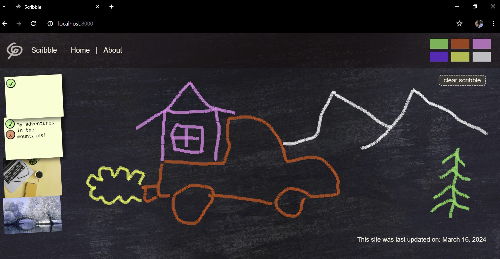

## About
- This is a presentation wordpress CRUD app
- on the interface you can add notes (these notes are saved to a database, they can be updated and deleted from the user interface)
- There is a fun scribble feature where the user can sketch drawings on the browser
- There are ACFs where an editor with access to the wp-admin can add images that show up below the notes.
- This includes SEO/schema
- This app can be used to start a WordPress project from scratch that runs on docker. In order to do that, delete all of the files and folders from this project except for the `docker-compose.yml` file. You can use the custom theme and other features as a starting point for creating your own WordPress app.

## Stack
- php
- WordPress
- WebPack
- SASS
- HTML
- Ajax
- jQuery
- VanilaJavascript
- Docker
- MySQL
- PhpMyAdmin

## Starting up the app

#### In this repository there are 2 different versions of the same app. 
- In the folder WORDPRESS_SITE_PHP, there is an app that runs mainly on php, it's not very interactive and has to reload at every change since php is a language that doesn't interact with the DOM. The reason why I kept this app is as a reference on interacting with database requests using php code and phpMyAdmin database interface.
- In the folder WORDPRESS_SITE_JS, the app completes database requests and appends data to the DOM without having to refresh the page, using ajax and jquery. To run this app check the README file in the folder WORDPRESS_SITE_JS/dataBase

#### If you are running the WORDPRESS_SITE_PHP version, before cloning the repo and run it, there is a file located at `WORDPRESS_SITE_PHP/javascript/clearNewNoteDiv.js` in that file there is a url, with a default value of `http://localhost:8000`, that url needs to be changed to the value equal to the homepage url where you wish to serve the website.

#### Go into your WSL shell terminal (if you are wising WSL), navigate into the folder where the wordpress site is located, run the command `docker-compose up -d` (this will create the images (wp and mysql) and start up a server in a docker container). visit `http://localhost:8000/` to view the website.
- If you are running wordpress in the system for the first time, you'll be prompted with a setup page. enter the requested info.

#### To edit your wp page go to `http://localhost:8000/wp-admin/` username and password are both set as admin unless you chose something different during setup.

#### To access phpMyAdmin go to `http://localhost:8080/` Username is `root` and password is `password` (these are set up in the `docker-compose.yml` file)
- If you're using a WLS you need to have the docker application open and running

#### WORDPRESS_SITE_PHP doesn't have a schema file yet, so you'll have to go to php my admin served at `http://localhost:8080/`. is you are running WORDPRESS_SITE_JS, you can follow the instructions from the README file in WORDPRESS_SITE_JS/dataBase folder
- Create a new database, name it `scribble`
- Create a new table with 3 columns, name it `notes`
    - Column1 = id (type: bigint 20. Under index: chose PRIMARY, check the A_I(auto increment) button)
    - Column2 = user_id (type: VARCHAR 50) 
    - Column3 = note (type: VARCHAR 500)
    - To clear the database type the following sql query: `delete from notes`

### For the correct content to show up, there are some settings that need to be changed from the default Wordpress settings
- Go to rout `http://localhost:8000/wp-admin/`
- Go to Appearance menu, select Themes, activate the theme called `custom theme child`
- Setting up your home page
    - Go to Pages, create a new page, name it Home.
    - Go to Settings menu, click on Reading, under "Your homepage displays" chose the option "A static page (select below)". Next to "Homepage:" chose the Homepage option.
    - Go to Pages, then edit Home page, set "Template" to "home page"
- Go to Settings menu, click on General change "Site Title" to Scribble
- Activate plugins
    - Go to Plugins, find the "Advanced Custom Fields" and click on `Activate`
    - Go to Plugins, find the "WP Markdown Editor (Formerly Dark Mode)" and click on `Activate`, if you want to work on dark mode

## Run sass compiler
#### In order to compile sass stylesheet during development you need to run `npm i` from within the `customtheme-child` folder to install all necessary dependencies, using the WSL Shell terminal(if you are using windows).
#### Secondly run the command; `npm run compile` (this will open a process that will automatically compile any changes you make in the `./WORDPRESS_SITE/wp-content/themes/customtheme-child/styles/style.scss` file)
